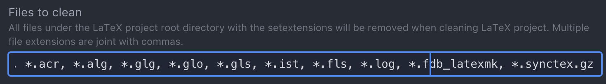

# Flip's Atom Set Up
December 11, 2018

Packages: `atom > preferences > install`

## LaTeX

### Packages
* `atom-latex` (not `latex`)
* `language-latex`
* `linter-spell-latex`


### References

* [Setting up Atom for LaTeX Gist](https://gist.github.com/Aerijo/5b9522530715e5be6e89fc012e9a72a8)
* [latex package in Atom](https://atom.io/packages/latex)
* [atom-latex package](https://atom.io/packages/atom-latex)
* [Using Atom as a LaTeX editor](https://medium.com/@lucasrebscher/using-atom-as-a-latex-editor-93756de3d726)

### Does it work?

With the packages above, LaTeX seems to work right out of the box.


### Packages

`latex` is a standard package that comes with with some auto-completions. I prefer `atom-latex` which has more features. Don't turn both of them on. It gets annoying.

### Spell Check

Atom has a nice spell checker, that you can configure to work in the LaTeX environment. However, this ends up marking LaTeX commands as spelling errors.

[Spell checking](https://stackoverflow.com/questions/47704586/spell-check-for-latex-file-in-atom):


A suggestion from [Aerijo's gist](https://gist.github.com/Aerijo/5b9522530715e5be6e89fc012e9a72a8#getting-latex-working) is to use `hunspell` and `linter-spell-latex`.

First you have to install `hunspell`, which you can do with `homebrew` [via](http://pankdm.github.io/hunspell.html)
```
brew install hunspell
```
Then [download dictionaries](http://wordlist.aspell.net/dicts/) and place into `/Library/Spelling/`.

Okay, this is a bit of a pain to set up. The first thing that happens is:  


I think the easiest thing is to disable the core `spell-check` package.  

We are still left with some issues. There are tons of "errors" that aren't really errors. You can use the shortcut `ctrl+return` to access the `intentions` package and add/ignore items for one's personal dictionary.
* **The problem**: This appears to be an issue with the [wordlist in hunspell](https://github.com/en-wl/wordlist/issues/122) coming from [which unicode character](https://stackoverflow.com/questions/37675866/hunspell-match-words-with-apostrophe) is being used.
* **The solution**: For now you have to manually hack the `aff` file used by `hunspell`, for example `en_US.aff`. In this file, change
```
WORDCHARS 0123456789
```
to
```
WORDCHARS 0123456789'
```
Thanks to [client9](https://github.com/marcoagpinto/aoo-mozilla-en-dict/issues/23).


### XeLaTeX

XeLaTeX doesn't work out of the box. One way to fix this is to go into the `atom-latex` settings and added it to the `latexmk` parameters:


I think this is a fine thing to do since XeLaTeX is a superset of pdfLaTeX. I'm not totally sure. What's nice is that the `atom-latex package` reminds you of your default options in case I want to go back.

However, an alternative is to continue using `latexmk` but to include a local `.latexmkrc` configuration file with the following instruction (from [this gist](https://gist.github.com/fnurl/3117980)):

```perl
# Use xelatex instead of pdflatex
$pdflatex = 'xelatex -synctex=1 -interaction=nonstopmode --shell-escape %O %S';
# Always create PDFs
$pdf_mode = 1;
```

This works quite nicely and one didn't have to change the default `atom-latex` options. You simply need to include the `.latexmkrc` file in the directories where you are using XeLaTeX. I find this convenient because I primarily use XeLaTeX for letters of recommendation. I can have the `.latexmkrc` file in each of these folders, but leave my default `latex` documents relatively universal.

**Life Pro Tip**: you can also name this file `latexmkrc` (without the period). This makes the file visible by default, which can help when copying templates.


An alternative is to use a custom `.latexcfg` toolchain for each project.  See the [atom-latex project-based configuration instructions](https://github.com/James-Yu/Atom-LaTeX#-set-per-project-latex-toolchain). I could not get this to work.


### Multiple files

If you have multiple tex files in a directory, you will need to set the `latex` [root file](https://atom.io/packages/atom-latex#root_file). The easiest way to do this is to simply compile the main file. You may need to go to **packages** > `atom-latex` > Build LaTeX from active editor.

For some reason this doesn't always work. There's a little icon of a house on the bottom that is also a shortcut for setting a root file.

### Clean

One of the things that I liked about TeXPad is that it automatically cleaned the auxilliary files after a compile. In `atom-latex` simply use: `ctrl+L ctrl+C`. Note that `.synctex.gz` files are *not* cleaned because it is important for running `synctex`. However, if you're like me, you only clean your working directory when you're done editing and hence don't need synctex. I went ahead and added `*.synctex.gz`:


Note that an alternative choice would be to select the option for `atom-latex` to clean automatically after each build. But in that case cleaning `.synctex.gz` would not be a good idea.


### PDF Viewer

`atom-latex` comes with a pdf viewer. You can `cmd-click` on the viewer to go directly to the line in the source. The default viewer opens in a new window. You can also set it to open in a new tab.·


## Markdown

* [Atom for academic writing](https://discuss.atom.io/t/using-atom-for-academic-writing/19222)
* [Customize Atom as a LaTeX and Markdown editor](http://yangjl.com/en/codes/2016/09/09/atom)
* [Atom as a markdown editor](https://www.news47ell.com/how-to/atom-best-markdown-editor-mac/)

### Packages
* `markdown-writer`
* `markdown-scroll-sync`


### Markdown shortcuts

You can always use `cmd+shift+p` and go to *Snippets: available*. A few useful tab-completions are `img` and `table`.

### packages

* `markdown-writer`

## GitHub synchronization

Setting this up. I started by using GitHub Desktop to make a repository.

* [GitHub for Atom](https://github.atom.io)

It's pretty easy: from `Packages > Git` (or  `ctrl+shift+9`) toggle the Git tab. From there you can fetch, stage, and commit updates.


## Atom Basics

Read the [flight manual](https://flight-manual.atom.io), the part about customization is required reading for using more advanced features.

* `cmd+shift+p`: command palette

* `Ctrl+Shift+M`: Toggle preview
