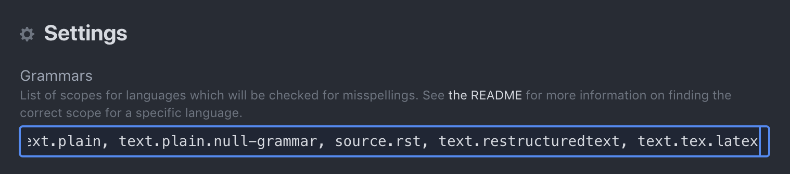
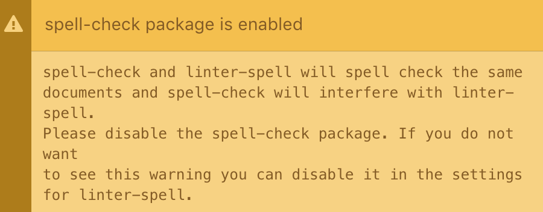
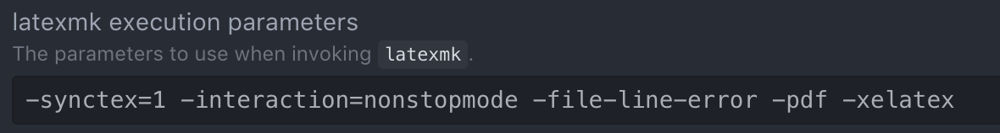

# Flip's Atom Set Up
December 11, 2018

Packages: `atom > preferences > install`

## LaTeX

* [Setting up Atom for LaTeX Gist](https://gist.github.com/Aerijo/5b9522530715e5be6e89fc012e9a72a8)
* [latex package in Atom](https://atom.io/packages/latex)
* [atom-latex package](https://atom.io/packages/atom-latex)
* [Using Atom as a LaTeX editor](https://medium.com/@lucasrebscher/using-atom-as-a-latex-editor-93756de3d726)

### Does it work?

With the packages above, LaTeX seems to work right out of the box.


### Packages

`latex` is a standard package that comes with with some auto-completions. I prefer `atom-latex` which has more features. Don't turn both of them on. It gets annoying.

### Spell Check

Atom has a nice spell checker, that you can configure to work in the LaTeX environment. However, this ends up marking LaTeX commands as spelling errors.

[Spell checking](https://stackoverflow.com/questions/47704586/spell-check-for-latex-file-in-atom):


A suggestion from [Aerijo's gist](https://gist.github.com/Aerijo/5b9522530715e5be6e89fc012e9a72a8#getting-latex-working) is to use `hunspell` and `linter-spell-latex`.

First you have to install `hunspell`, which you can do with `homebrew` (via)[http://pankdm.github.io/hunspell.html]
```
brew install hunspell
```
Then download dictionaries from (http://wordlist.aspell.net/dicts/)[http://wordlist.aspell.net/dicts/] and place into `/Library/Spelling/`.

Okay, this is a bit of a pain to set up. The first thing that happens is:
. I think the easiest thing is to disable the core `spell-check` package.  

We are still left with some issues. There are tons of "errors" that aren't really errors. You can use the shortcut `ctrl+return` to access the `intentions` package and add/ignore items for one's personal dictionary.

### XeLaTeX

XeLaTeX doesn't work out of the box. I went into the atom-latex settings and added it to the latexmk parameters:


A more realistic implementation is to use a [custom toolchain per project](https://github.com/James-Yu/Atom-LaTeX/issues/154#issuecomment-387415756).


## Markdown

* [Atom for academic writing](https://discuss.atom.io/t/using-atom-for-academic-writing/19222)
* [Customize Atom as a LaTeX and Markdown editor](http://yangjl.com/en/codes/2016/09/09/atom)
* [Atom as a markdown editor](https://www.news47ell.com/how-to/atom-best-markdown-editor-mac/)

### Markdown shortcuts

You can always use `cmd+shift+p` and go to *Snippets: available*. A few useful tab-completions are `img` and `table`.

### packages

* `markdown-writer`

## GitHub synchronization

Setting this up. I started by using GitHub Desktop to make a repository.

* [GitHub for Atom](https://github.atom.io)

## Atom Basics

Read the [flight manual](https://flight-manual.atom.io), the part about customization is required reading for using more advanced features.

* `cmd+shift+p`: command palette

* `Ctrl+Shift+M`: Toggle preview

`
